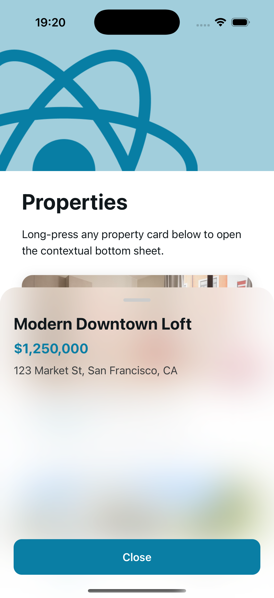

# Property Bottom Sheet

A bottom sheet component that displays detailed property information when users **long-press** a property card. The component is optimized per platform to provide a more native-like experience on both iOS and Android.

## Demo

### iOS

On iOS, the bottom sheet uses a **frosted glass** background, similar to `UISheetPresentationController` / SwiftUI sheets, and automatically respects the home indicator safe area.

<p align="center">
  
</p>

### Android

On Android, the bottom sheet uses a **solid surface** with shadow from `elevation`, while also respecting navigation bar insets.

<p align="center">
  
</p>

## Required Libraries

This component is built with the following libraries:

| Library                          | Purpose                                                          |
| -------------------------------- | ---------------------------------------------------------------- |
| `expo-blur`                      | Provides the frosted glass blur effect on iOS                    |
| `react-native-reanimated`        | Handles smooth open / close animations and animated styles       |
| `react-native-gesture-handler`   | Handles pan gestures for dragging the sheet                      |
| `react-native-safe-area-context` | Reads safe area insets for the home indicator and navigation bar |
| `react-native-worklets`          | Allows calling React Native callbacks from gesture worklets      |

Install the required dependencies:

```bash
npx expo install expo-blur react-native-reanimated react-native-gesture-handler react-native-safe-area-context react-native-worklets
```

> Note: `react-native-reanimated` and `react-native-gesture-handler` require proper setup in your app. Make sure the Reanimated Babel plugin is configured, and follow the official setup instructions for `react-native-worklets`.

## API

```tsx
import { PropertyBottomSheet } from "@/components/bottom-sheet/property-bottom-sheet";
```

### Props

| Prop       | Type         | Required | Description                                                                 |
| ---------- | ------------ | -------- | --------------------------------------------------------------------------- |
| `visible`  | `boolean`    | ✅       | Controls whether the bottom sheet is visible                                |
| `onClose`  | `() => void` | ✅       | Callback triggered when the sheet should close, such as after dragging down |
| `children` | `ReactNode`  | ❌       | Content rendered inside the bottom sheet                                    |

## Usage Example

```tsx
import { useState } from "react";
import { View, Text, Pressable } from "react-native";
import { PropertyBottomSheet } from "@/components/bottom-sheet/property-bottom-sheet";

export function PropertyCard() {
  const [isOpen, setIsOpen] = useState(false);

  return (
    <>
      <Pressable
        onLongPress={() => setIsOpen(true)}
        style={{
          padding: 16,
          backgroundColor: "#f2f2f2",
          borderRadius: 12,
        }}
      >
        <Text>Long-press the property card</Text>
      </Pressable>

      <PropertyBottomSheet visible={isOpen} onClose={() => setIsOpen(false)}>
        <Text style={{ fontSize: 18, fontWeight: "600" }}>Property Name</Text>
        <Text>Address: District 1, Ho Chi Minh City</Text>
        <Text>Price: 5 billion VND</Text>
      </PropertyBottomSheet>
    </>
  );
}
```

## Platform Details

### iOS

- **Frosted glass background**: Uses `BlurView` from `expo-blur`, combined with a semi-transparent overlay to create a native-like glass effect.
- **Home indicator safe area**: Uses `useSafeAreaInsets()` to add bottom padding, preventing content from overlapping the home indicator area.
- **Animation**: Opens with a spring animation and closes with a timing animation using cubic easing.

### Android

- **Solid surface**: Uses a regular `View` background instead of blur, because blur support on Android is less consistent.
- **Elevation shadow**: Applies `elevation` to create a native Android shadow.
- **Navigation bar insets**: Uses `useSafeAreaInsets()` so the sheet content does not overlap the Android navigation bar, including both gesture navigation and 3-button navigation.

## Interaction Behavior

- **Drag down to close**: Users can swipe downward to close the sheet.
- **Close threshold**: The sheet closes when dragged down more than **25% of its height** or when the downward swipe velocity is greater than **700**.
- **Subtle bounce**: When dragged upward, the sheet allows a small bounce effect using `Math.max(-8, nextY)`.

## Notes

- The component renders with `zIndex: 100`, so make sure parent containers do not clip it with `overflow: "hidden"`.
- The default sheet height is **55% of the screen height**, capped at **420px**.
- Dark mode is supported automatically through `useColorScheme()`.
- On Android, shadow visibility depends mostly on `elevation` and a solid `backgroundColor`.
